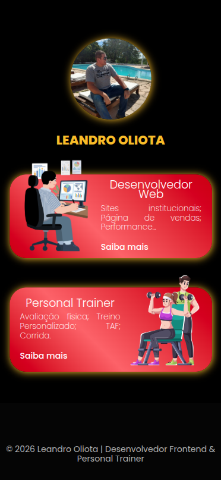

# 🚀 Leandro Oliota — Portfólio Dev & Personal

Projeto desenvolvido com **React + Vite**, unificando duas áreas profissionais:

- 💻 Desenvolvedor Front‑end
- 🏋️ Personal Trainer

A proposta é ter uma **landing inicial com escolha de área** e rotas separadas para cada atuação, utilizando boas práticas modernas de componentização, organização de pastas e CSS Modules.

---

## 🌐 Deploy

🔗 Produção: [https://leandrooliota.com](https://leandrooliota.com)
🔗 Vercel: [https://leandro-oliota.vercel.app/](https://leandro-oliota.vercel.app/)

Deploy automatizado via **Vercel** conectado ao GitHub.

---

# 📚 Objetivo do Projeto

Este projeto não é apenas um portfólio.
Ele também serve como:

- 📖 Registro de evolução com React
- 🧱 Prática de arquitetura escalável
- 🎯 Aplicação de boas práticas (componentização, variantes, CSS Modules)
- 🧠 Material de estudo para iniciantes

A ideia é evoluir gradualmente, melhorando estrutura e organização a cada commit.

---

# 🛠️ Tecnologias Utilizadas

- ⚛️ React
- ⚡ Vite
- 🧭 React Router DOM
- 🎞️ Swiper.js (galeria de depoimentos)
- 🎨 CSS Modules

---

# 📂 Estrutura Atual do Projeto

```
src/
 ├── components/
 │    ├── ChoiceCard/
 │    ├── SwiperTestimony/
 │    └── ...
 │
 ├── pages/
 │    ├── Home/
 │    ├── Dev/
 │    └── Personal/
 │
 ├── assets/
 ├── App.jsx
 └── main.jsx
```

### 📌 Organização adotada

- Cada componente possui sua própria pasta.
- Uso de `*.module.css` para evitar conflitos de estilo.
- Componentes reutilizáveis utilizam **props dinâmicas**.
- Estrutura pensada para escalabilidade futura.

---

# 🧩 Componentes Criados

## 🔹 ChoiceCard

Card reutilizável utilizado na página inicial para direcionar o usuário.

Possui suporte a:

- Props dinâmicas
- Variante de estilo
- CSS Module isolado

---

## 🔹 SwiperTestimony

Slider de depoimentos utilizando Swiper.

Recursos implementados:

- Autoplay
- Paginação clicável
- Loop infinito
- Breakpoints para responsividade

Exemplo de responsividade:

```js
breakpoints={{
  0: { slidesPerView: 1 },
  768: { slidesPerView: 2 },
  1200: { slidesPerView: 3 }
}}
```

---

# 🎨 Decisões Técnicas Importantes

### ✅ CSS Modules

Adotado para evitar problemas de cascata e conflitos globais.

Exemplo:

```js
import styles from "./ChoiceCard.module.css";
```

Isso garante isolamento de estilos e maior escalabilidade.

---

### ✅ Conventional Commits

Os commits seguem padrão como:

```
feat: add home navigation link
refactor(ChoiceCard): migrate CSS to CSS Module
```

Isso mantém o histórico organizado e profissional.

---

# 📈 Evolução do Projeto

✔ Migração de HTML/CSS puro para React
✔ Separação em rotas (/dev e /personal)
✔ Componentização progressiva
✔ Implementação de CSS Modules
✔ Deploy e domínio próprio configurado

Próximos passos incluem:

- Melhorar animações
- Refinar Design System
- Criar versão mais escalável
- Evoluir para aplicação com backend futuramente

---

# 📸 Screenshots

### 🏠 Home



### 💻 Dev


### 🏋️ Personal


---

# 🧠 Para Iniciantes

Se você está começando no React, este projeto mostra:

- Como estruturar pastas
- Como usar React Router
- Como componentizar corretamente
- Como evitar conflitos de CSS
- Como fazer deploy profissional

## 🚀 Como rodar localmente

> Não importa o seu sistema operacional, o processo é bem parecido. Escolha o terminal de sua preferência (**Git Bash**, **PowerShell**, **Terminal do Mac** ou **Linux**) e siga os passos:

```bash
git clone https://github.com/LeandroDevLab/leandro-oliota
cd leandro-oliota
npm install
npm run dev
```

---

# 👨‍💻 Autor

**Leandro Oliota**
Desenvolvedor Front‑end & Personal Trainer

🔗 GitHub: [https://github.com/LeandroDevLab](https://github.com/LeandroDevLab)

---

# ⭐ Contribuição

Sinta-se à vontade para abrir issues ou sugerir melhorias.

---

> Projeto em constante evolução 🚀
